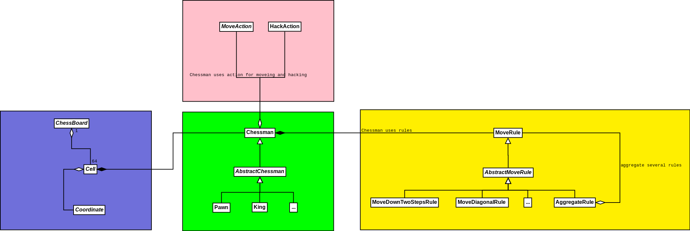

# Chess game
This is console chess game.

## How to build and run
```
mvn clean package
java -jar target/chess-1.0-SNAPSHOT-jar-with-dependencies.jar 
```

## Architecture overview
There are 4 groups of Classes.

*Chessman* (green on diagram) represents a game chessmen like a Pawn, Bishop ant etc. 
Any chessman encapsulate motion strategy or composition of motion strategies. 
Also some chessmen could switch strategies depends on situation. Just as example in first turn 
pawn can move forward 2 steps. But in other cases it can move forward only one step.

*MoveStrategy* (yellow on diagram) encapsulate motion strategies like go forward one step, 
go any direction one step, go horizontal until border and so on. Of course, these strategies 
take into account the position of borders.

*Actions* (rose on diagram) encapsulate logic of movements and hacks. I prefer to move it from
`AbstractChessman` because it makes code simpler and increase testability.

*Game field* (blue on diagram) represents a game field like a chessboard and cells. Also each 
cell has a coordinate. 



## Known bugs
 - no horses
 - every chessman moves like a horse (it jumps over another chessman)
 
## Unknown bugs
I suppose it has a lot ot them :)